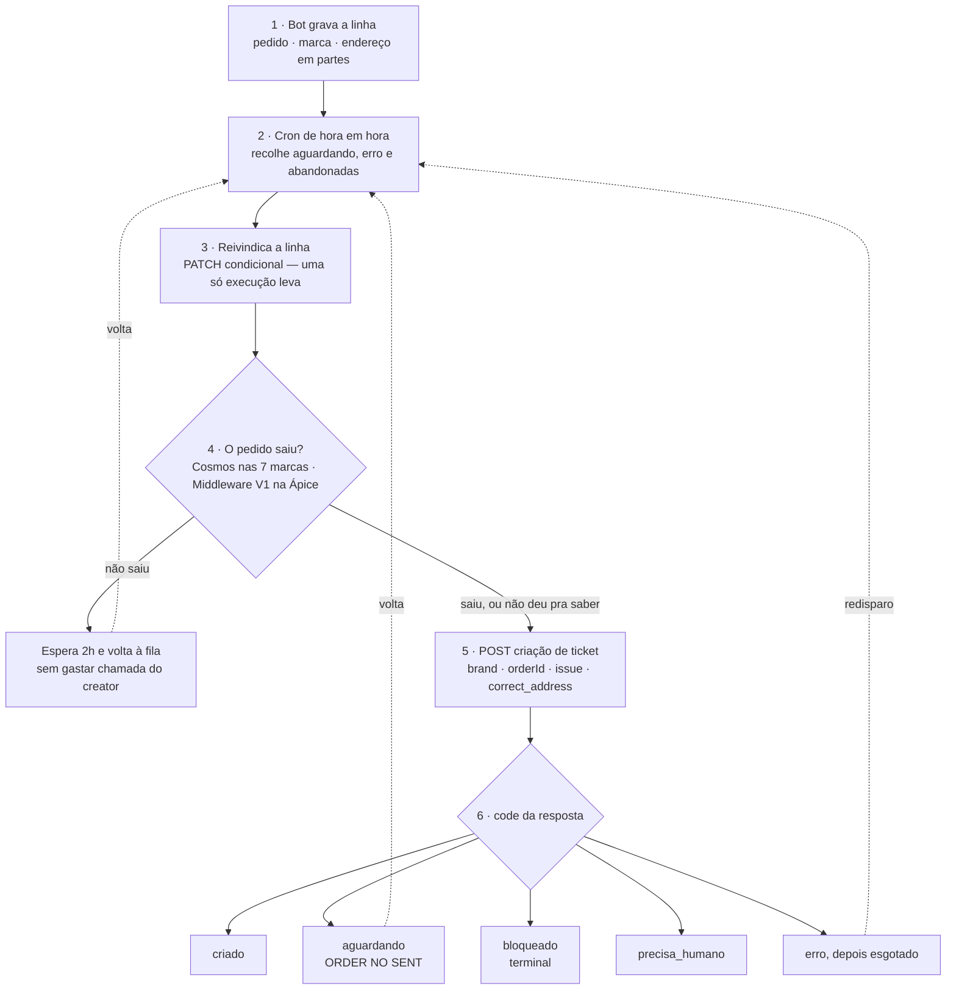

# Tickets a Disparar

Fila de alteração de endereço de entrega.

O cliente pede para mudar o endereço. O ticket com a transportadora só pode ser
aberto **depois que o pedido saiu** — esta aba é quem espera essa hora chegar,
dispara, e mostra o que falhou.

O bot alimenta a tabela `enderecos_para_ticket`; a Central cuida do resto.

- **Aba:** "Tickets a Disparar" na Central
- **Tabela:** `enderecos_para_ticket`, projeto Supabase `ozwcyrkzsqzmavjtsmsp`
- **Destino:** `cx-ticketcreator`, issue `Endereço Errado`

---

## O fluxo



### Por que o gate existe, se o creator também checa

Cada chamada de criação custa ao creator **uma busca do pedido na origem mais
uma na Intelipost**, mesmo quando termina recusada. Perguntar de hora em hora
por um pedido que vai levar três dias para sair são dezenas de buscas jogadas
fora.

E existem **dois caminhos para "não saiu", de propósito**: o passo 4 é a nossa
checagem, que economiza a chamada; o `ORDER NO SENT` do creator é a segunda rede.
Quando o passo 4 fica inconclusivo (marca sem fonte, Cosmos fora, valor de status
novo), a linha atravessa e o creator decide. Otimização de um lado, garantia do
outro — nenhuma das duas depende da outra estar certa.

### Fonte de status por marca

| marca | fonte | sinal de "saiu" |
| --- | --- | --- |
| Kokeshi, Lescent, By Samia, Aua, Barbour's, Rituária, Yenzah | Cosmos | `logistic_status` diferente de `waiting` |
| **Ápice** | **Middleware V1** (GET aberto, sem credencial) | `status = sent` |
| valor novo, ou registro ausente | — | inconclusivo, segue para o creator |

A Ápice não está no Cosmos — confirmado por três vias: o resolver do bot manda
Ápice por Middleware V1, o datamart tem `external_cosmos_id` nulo em 58.949
pedidos dela, e a conta de serviço do Cosmos não a lista nos `memberships`.

---

## Como o bot escreve na tabela

```
POST https://ozwcyrkzsqzmavjtsmsp.supabase.co/rest/v1/enderecos_para_ticket?on_conflict=pedido,marca
```

| header | valor |
| --- | --- |
| `apikey` | a **service_role** key do projeto |
| `Authorization` | `Bearer <service_role key>` |
| `Content-Type` | `application/json` |
| `Prefer` | `resolution=merge-duplicates,return=representation` |

### Corpo

```json
{
  "pedido": "2824057",
  "marca": "KOKESHI",
  "endereco_atual": "Rua das Laranjeiras, 88, Centro, Campinas, SP, BR, 13010-100",
  "novo_endereco": "Avenida Faria Lima, 3477, Conjunto 142, Itaim Bibi, Sao Paulo, SP, BR, 04538-133",
  "end_logradouro": "Avenida Faria Lima",
  "end_numero": "3477",
  "end_complemento": "Conjunto 142",
  "end_bairro": "Itaim Bibi",
  "end_cidade": "Sao Paulo",
  "end_uf": "SP",
  "end_cep": "04538-133",
  "end_pais": "BR"
}
```

Aceita array para inserir várias de uma vez.

### ⚠️ Nunca mandar `status`

Com `resolution=merge-duplicates`, **só as colunas presentes no corpo são
atualizadas**. Omitindo `status`, um segundo pedido de troca no mesmo pedido
atualiza o endereço e deixa o estado da fila intacto.

Mandando `"status": "aguardando"` numa linha que já está `criado`, a Central
entende como caso novo e **abre um segundo ticket na transportadora para o mesmo
pedido**. O default do banco já é `aguardando` no insert novo, então não há
motivo para mandar — e há um motivo forte para não mandar.

> **Consequência conhecida:** com `status` omitido, um segundo endereço num pedido
> que já tem ticket fica gravado mas *não chega à transportadora* — o creator
> responde `TICKET_EXISTS`. É melhor que ticket duplicado, mas é um caminho sem
> saída, e o tratamento é decisão de processo em aberto.

### Por que service_role e não a anon

A tabela guarda endereço de cliente, então tem RLS habilitado **sem policy para a
role `anon`** — a chave anon está no código-fonte de um app público, e liberar
`anon` aqui equivaleria a publicar endereço de cliente na internet. Com a anon o
insert é recusado (verificado):

```json
{ "code": "42501", "message": "new row violates row-level security policy for table \"enderecos_para_ticket\"" }
```

Alternativa mais segura, se não quiserem dar service_role ao bot: uma policy de
**INSERT apenas** amarrada a uma role dedicada, com JWT dessa role. Mais setup.

### Colunas

| coluna | obrigatória | vira no creator | regra |
| --- | --- | --- | --- |
| `pedido` | sim | `orderId` | O id do pedido na **origem** da marca — id do Cosmos nas 7 marcas, número Shopify na Ápice. **Não é a NF** e **não é a `reference`** (essa o creator devolve). |
| `marca` | sim | `brand` | Maiúsculo. A Central converte para minúsculo. |
| `novo_endereco` | sim | `fullAddress` | Vai **verbatim** para a transportadora. |
| `end_logradouro` | sim | `address1` | Rua, avenida. |
| `end_numero` | sim | `address2` | **O número.** Não é "segunda linha do endereço". |
| `end_complemento` | não | `address3` | Vazio quando não houver — nunca `"N/A"` ou `"-"`, porque qualquer texto entra no endereço que a transportadora lê. |
| `end_bairro` | sim | `address4` | **O bairro.** Também não é "quarta linha". |
| `end_cidade` | sim | `city` | |
| `end_uf` | sim | `state` | Sigla de 2 letras. |
| `end_cep` | sim | `zipcode` | Com ou sem máscara. |
| `end_pais` | não | `country_code` | Default `BR`. |
| `endereco_atual` | não | — | Não vai para o creator; serve para o agente comparar na tela. |

A nomenclatura `address1..4` é herdada dos payloads do n8n e não segue lógica
nenhuma. Trocar `end_numero` por complemento manda o número errado para a
transportadora, e **isso não dá erro em lugar nenhum**.

**Endereço estruturado não é opcional.** A regra do creator compara só as partes
(`city`, `state`, `address1`, `address2`, `zipcode`) e nunca faz parse do
`novo_endereco`. Linha só com texto livre passa da checagem de "veio endereço?" e
morre depois como `ADDRESS_UNVERIFIABLE`. Mínimo para a regra decidir: **cidade +
UF, mais logradouro ou CEP.**

### Colunas que o bot NÃO deve escrever

São da Central e escrever nelas atropela o controle de fila:

```
status · tentativas · ultimo_erro · ultimo_erro_em · ultimo_code · blocked_reason
proxima_tentativa_em · ticket_reference · ticket_id · ticket_status
ticket_deadline · delivery_status · delivery_date · tracking_code · carrier
cliente · status_visto_em · disparado_em · criado_em · atualizado_em
```

### Marcas aceitas

`KOKESHI` · `APICE` · `RITUARIA` · `BARBOURS` · `LESCENT` · `AUA` · `BYSAMIA` ·
`GOCASE` · `YENZAH`

Marca fora dessa lista entra na tabela mas **nunca dispara**: a Central não
consegue mapear para nenhuma das 9 `brand` do creator, e a linha para em `erro`
com `MARCA_DESCONHECIDA`.

### Respostas

| situação | resposta |
| --- | --- |
| inseriu | `201` com a linha |
| já existia, atualizou | `200` com a linha |
| chave errada, ou anon | `401` + `42501` (RLS) |
| coluna que não existe no corpo | `400` + `42703` com o nome dela |
| `status` fora da lista | `400` + `23514` (o CHECK da tabela) |

Não há validação de endereço no banco: linha incompleta **entra normalmente** e só
falha depois, quando a Central chama o creator.

---

## Estados da linha

| code do creator | estado | o que acontece depois |
| --- | --- | --- |
| `ADDRESS_TICKET_CREATED`, `TICKET_EXISTS`, `TICKET_COMPLETED` | `criado` | Guarda a `reference` que o creator devolveu, mais o status de entrega do momento da abertura. |
| `ORDER NO SENT` | `aguardando` | Volta à fila com espera de 2h. **Não conta tentativa** — não é falha. |
| `ADDRESS_CHANGE_BLOCKED` | `bloqueado` | **Terminal.** Sai da fila e não ganha botão de redisparo: a regra recusou e tentar de novo devolve o mesmo. Falta avisar o cliente. |
| `CARRIER_NOT_AUTOMATED`, `ADDRESS_MISSING`, `ADDRESS_UNVERIFIABLE`, `ESCALATE_TO_HUMAN` | `precisa_humano` | Sai da fila e espera pessoa. |
| `4xx` / `5xx` | `erro` | Volta para a fila de redisparo. Cinco tentativas e para (`esgotado`). |
| — | `nao_se_aplica` | Pedido cancelado ou entregue antes de dar tempo. |

**A J&T só aceita mudança de número e complemento**, mesmo na mesma cidade. Uma
fatia dos pedidos vai ser legitimamente recusada — `bloqueado` não é bug.

A ordem de avaliação do creator importa: a transportadora é checada no passo 5 e o
endereço só no 9, então um `precisa_humano` não quer dizer necessariamente que o
endereço estava ruim.

---

## Quatro coisas que pareciam certas e não eram

**`sent_at` não significa que o pedido saiu.** No Middleware V1, `sent_at`,
`status_erp = "enviado"` e `has_been_fulfilled = true` querem dizer "exportado
para o ERP". Seis pedidos parados no CD há quatro dias vinham com os três
preenchidos, enquanto o `status` real era `ready_for_shipping`. Um gate feito no
`sent_at` abriria ticket de transportadora para pedido que nem saiu do galpão.

**Número de pedido não é único entre marcas.** Cada origem tem sua própria
sequência. A NF `968609` existe em Ápice, Barbour's *e* Kokeshi. Com chave única
só em `pedido`, a segunda marca a pedir troca no mesmo número era rejeitada como
duplicada e a cliente ficava sem ticket, sem sintoma. A chave é `(pedido, marca)`.

**O `organization_id` da Rituária não era o que faltava na sequência.** Os ids
configurados eram 3, 4, 5, 6, 8 — e 7 parecia ser a Rituária. É **9**. Os
`memberships` que o login do Cosmos devolve dizem isso de graça. Um id errado
consulta os pedidos de outra marca e pode devolver um pedido diferente com número
parecido.

**O cron reportava sucesso sem fazer nada.** A rota devolve HTTP 200 mesmo em
falha, de propósito: 5xx faz o cron reexecutar a cada 30s e nenhuma das falhas
possíveis melhora com retry. O efeito colateral foi um painel que mente — cerca de
140 execuções verdes enquanto todas morriam numa coluna que não existia. Daí o
banner de saúde no topo da aba, que cobre também o caso do lote que *parou* de
rodar.

---

## Setup

### Migração

- `enderecos_para_ticket_schema.sql` — ambiente novo
- `enderecos_para_ticket_migracao.sql` — banco que já rodou a primeira versão
- `enderecos_para_ticket_seed_teste.sql` — linhas de teste com `orderId`
  propositalmente inexistente, que não conseguem tocar pedido de cliente real

### Secrets

| secret | para quê |
| --- | --- |
| `TICKET_WEBHOOK_SECRET` | o `cx-ticketcreator`. Sem ele a criação roda em mock |
| `SB_SERVICE_KEY` | a tabela (RLS sem policy para anon) |
| `COSMOS_BASE_URL`, `COSMOS_EMAIL`, `COSMOS_PASSWORD` | o gate nas 7 marcas |
| `COSMOS_ORG_IDS` | JSON marca → organization_id |
| `COSMOS_CAMPO_STATUS`, `COSMOS_ESTADOS_NAO_ENVIADO` | opcionais, ajuste sem redeploy |
| `MIDDLEWARE_V1_BASE_URL`, `MIDDLEWARE_V1_IDS` | opcionais, têm default no código |

### Cron

`POST /api/enderecos-processar`, de hora em hora. A rota responde **200 mesmo em
falha** de propósito — 5xx faz a plataforma reexecutar a cada 30s. O desfecho de
cada lote fica gravado e aparece no banner da aba.

### Rotas

| rota | o quê |
| --- | --- |
| `GET /api/enderecos-list` | a fila e os contadores |
| `GET /api/enderecos-contadores` | só a contagem, para o badge do menu |
| `POST /api/enderecos-processar` | o lote do cron |
| `POST /api/enderecos-criar-manual` | uma linha só, sem esperar o cron |
| `GET /api/enderecos-consultar` | consulta read-only no creator |
| `POST /api/enderecos-reconciliar` | confere a nossa versão contra a dele |
| `GET /api/enderecos-payload-preview` | o JSON exato que seria postado |
| `GET /api/enderecos-cosmos-debug` | o que o gate lê na origem |

Todas exigem autorização **inclusive na leitura** — a tabela guarda endereço de
cliente. Aceita o SSO do gateway (`x-godeploy-user-email` com allowlist de
domínio), a trigger key, ou o cron.

> ⚠️ Isso só é seguro enquanto o app for `authenticated`. **A Central de produção
> é pública** — se o fluxo for para lá, o header é forjável e essas rotas abrem.

---

## Decisões em aberto

Nenhuma é de código.

1. **Pedido em "saiu para entrega"** (~4.300/mês). O gate deixa passar, porque
   tecnicamente saiu — e aí abre ticket para pacote já no caminhão. Disparar
   igual, ou fila separada?
2. **Segundo endereço num pedido que já tem ticket.** Fica gravado e não chega à
   transportadora.
3. **Quem avisa o cliente no `bloqueado`.** Hoje nada acontece: a linha fica lá.
4. **Onde mora o laço de disparo.** Central ou bot. O bot já tem os clients de
   Cosmos e Middleware e a credencial por marca; hoje a Central mantém uma segunda
   cópia dessa configuração, que pode divergir.
5. **O que é o `CXHUB_TICKET_WEBHOOK` da Torre.** Se for o `cx-ticketcreator`, o
   payload da Torre não bate com o contrato dele e vai tomar `400
   INVALID_PAYLOAD` por falta de `orderId`.
